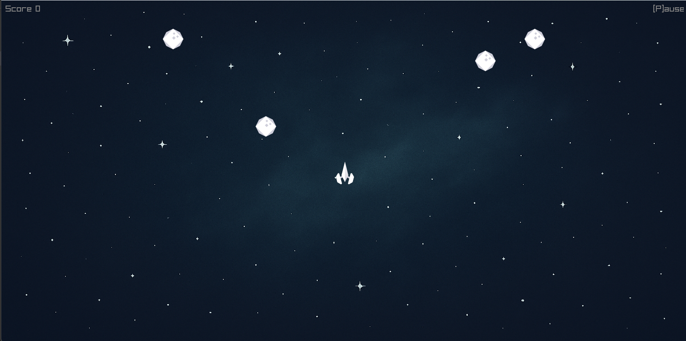
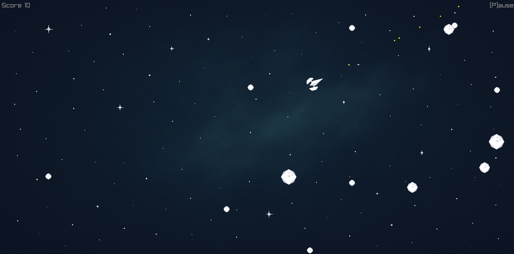

# 📘 Astroid Shooter

> Astroid shooter game written in go using raylib-go 

---

## 🧩 Overview

Game development is one of the largest branches of programming and is usually done with frameworks like the Unity (C#) or Unreal (C++) Engines. However game development with these frameworks is typically quite complex and require a lot of setup and learning. Go, on the other hand, is known for its simplicity and strong performance making it ideal for rapid (simple) game development. This project builds a retro-style asteroid shooter, focusing on game loops, collision detection, and rendering.

---

## 🎯 Objectives / Learning Goals

- 🔹 [Goal 1] — Learn Go structuring and syntax. 
- 🔹 [Goal 2] — Explore Go’s graphics libraries.  
- 🔹 [Goal 3] — Learn how to implement game loop structures with go architecture (update, render, input, etc...).
- 🔹 [Goal 4] — Learn to deploy distributable games (via GitHub Actions).

---

## ⚙️ Tech Stack

| Category | Tools / Languages |
|-----------|------------------|
| Language | `Go` |
| Libraries | `Raylib-go`|

---

## 🧪 Usage / Running the Project

### 🖥️ Setup

install go from: https://go.dev/dl/ - This is a go project so installing the language is essential.

install MSYS2 to get mingw-w64 https://www.msys2.org/ - this is needed for compiling the raylib-go library .dll file

After MSYS2 is installed, open the MSYS2 console and run the following command:

```nginx
pacman -Syu
```

update the base system and install the necessary dependencies, importantly the mingw-w64 package for compiling the raylib-go library.

After the dependencies are installed, close the window (if it hasnt automatically) and open  MSYS2 MinGW x64 terminal (important: NOT the plain MSYS one), then install GCC for 64-bit using the following command:

```nginx
pacman -Syu
pacman -S mingw-w64-x86_64-gcc
```

Once the install is complete, open the environment variables and add: 
```
C:\msys64\mingw64\bin to the path variable. 
```
(This will allow you to run the go command from the terminal.)
Restart the terminal/VSCode and check gcc has installed by running:
```
gcc --version`
```

With gcc now installed at in the path, you can run the go command from the terminal.

```
go env -w CGO_ENABLED=1
go env -w CC=gcc
```

This will point the go command to use the gcc compiler.
To check these were correctly set run:
```
go env CGO_ENABLED  # should be 1
go env CC           # should be gcc
```

install raylib-go https://github.com/gen2brain/raylib-go - raylib is a graphics library for go that is used for the graphical interface of this project.
```
go get -u github.com/gen2brain/raylib-go/raylib@latest
```


---

### ▶️ Run

once the dependencies are installed, you can run the game by running the following command:

```bash
go run main.go
```

alternatively you can build the game executable by running the following command:

```bash
go build main.go
```

---

## 📊 Results / Observations

The game is a simple retro-style asteroid shooterand starts up with a given number of large initial asteroids

 


The game can be played by moving the ship using the arrow keys and pressing space to fire. When shot the asteroids explode into smaller fragments until the small astroids are destroyed whereupon the disappear completely. Once the player has been hit by an asteroid, the game is over.
 

---

## 🔮 Future Improvements

- Add ship selection with differrent stats (structure ready but need GUI)
- Add enemies to fight
- Add powerups to change speeds and shots
- Add health bar to allow ship to take accumulating damage

---

## 📚 References / Resources

- [Library or Framework Docs](https://github.com/gen2brain/raylib-go)
- [Background Image](https://github.com/timlittle/blog-code/blob/main/go-asteroids/resources/space_background.png)
- [Sprite Tile Sheet](https://github.com/timlittle/blog-code/blob/main/go-asteroids/resources/tilesheet.png)

---

## 🧑‍💻 Author

**Olly Bayley**  
GitHub: [@ombayley](https://github.com/ombayley)  

---

## 🪪 License

This project is licensed under the **GNU General Public License (GPL)** — See the [LICENSE](LICENSE) file for details.
The GPL License is a copyleft license, that requires any derivative work to also be released under the GPL License.
This means any derivative software that uses this code remains open-source and freely available to the public.

